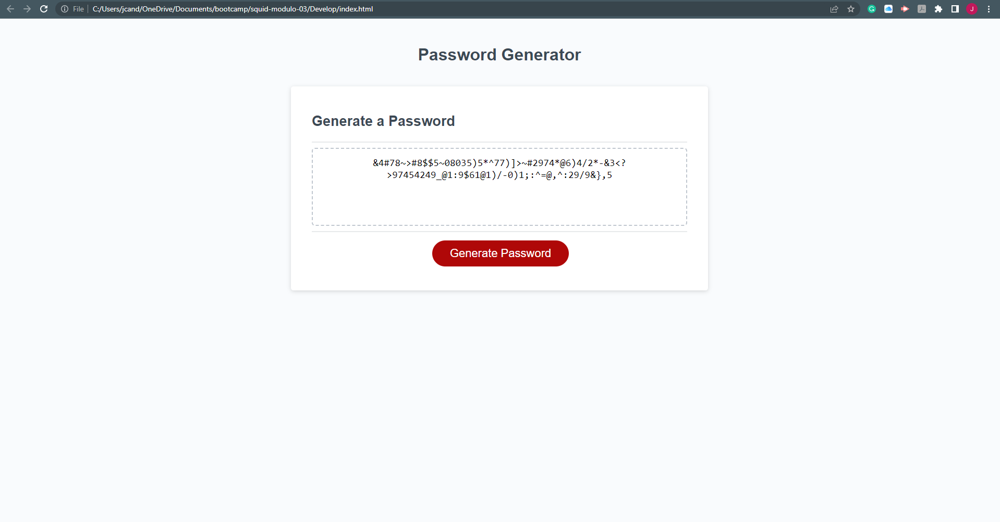

# Password Generator

## Description

This project was meant to help teach me the basics of Javascript. I started with very little source code. The password critera, length, and generate functions are the ones I added. The criteria and length functions return input from the user to the generatePassword function. There the password is generated using the user specified criteria to build it.

## Webpage Link

https://jcandrew1219.github.io/squid-modulo-03/

## Usage

The user clicks on the generate password button, answers the series of prompts then is able to copy the generated password.

## Screenshot

